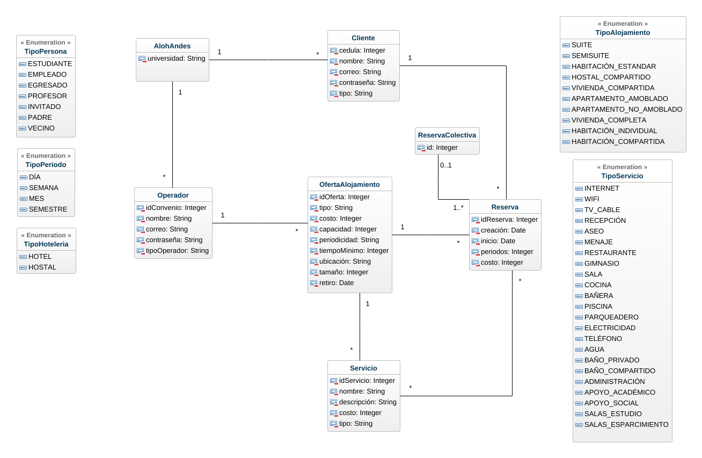

# Aloha-Andes

Java desktop application for managing lodging offers, clients, reservations, and analytical queries for the **Alohandes** transactional systems project.


This repository contains the final project for the *Transactional Systems* course at Universidad de los Andes. The application is built with Java, uses JDBC/DataNucleus JDO for persistence, and is configured to connect to Oracle.

## Repository layout

- `Alohandes/`: main Java application (GUI, business logic, persistence, resources, SQL/data files)
- `Proyecto/`: course iteration deliverables (documents, SQL, conceptual models)
- `Talleres/`: workshop deliverables

## Features implemented in code

From `Alohandes/src/main/resources/config/interfaceConfigApp.json`, the application menu includes:

- Functional requirements (RF): create operator, create lodging offer, create client, create/delete reservation, collective reservation operations, enable/disable offer
- Query requirements (RFC): income received, popular offers, occupancy index, available lodging, usage analysis, frequent clients, low-demand offers, consumption and operation reports

## Prerequisites

- Java JDK (project compiles with `javac`)
- Oracle database reachable from the application
- Required JAR dependencies already included in `Alohandes/lib/`

### Oracle (Docker example)

```bash
docker run -d --name oracle-db \
  -p 1521:1521 \
  -p 5500:5500 \
  -e ORACLE_PWD=adminpassword \
  container-registry.oracle.com/database/express:latest
```

Then update connection settings as needed in:

- `Alohandes/src/main/resources/META-INF/persistence.xml`

## Build and run

```bash
cd Alohandes
javac -cp "lib/*" -encoding UTF-8 -d bin $(find src -name "*.java")
java -cp "bin:lib/*:src/main/resources" uniandes.isis2304.alohandes.interfazApp.InterfazAlohandesApp
```

## Key project structure (`Alohandes/src/main/java`)

- `uniandes/isis2304/alohandes/interfazApp/`: Swing interface (`InterfazAlohandesApp`, `PanelDatos`)
- `uniandes/isis2304/alohandes/negocio/`: domain and business facade (`NegocioAlohandes`, entities/VOs)
- `uniandes/isis2304/alohandes/persistencia/`: SQL and persistence layer (`PersistenciaAlohandes`, `SQL*` classes)

## Images in repository

Application logo:


Conceptual model:



## License

No `LICENSE` file is currently present in this repository.
